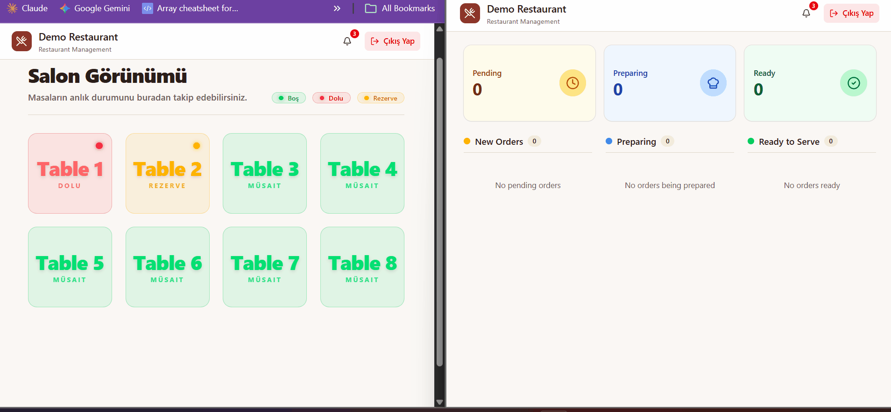
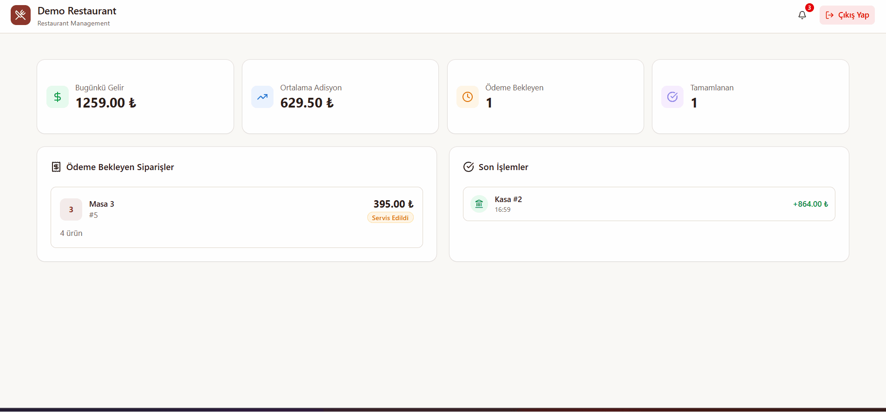
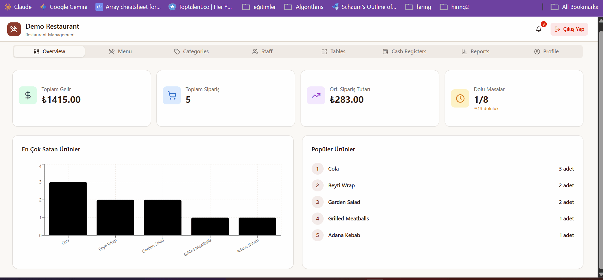

<h1 align="center">🍽️ RestaurantBill</h1>

<p align="center">
  <strong>A Production-Ready, Multi-Client Restaurant POS & Kitchen Display System</strong><br/>
  Architected for scalability and real-time synchronization using .NET 9, Clean Architecture, CQRS (MediatR), and SignalR. Designed to handle concurrent operations across waitstaff, kitchen, and cashier environments without data inconsistency.
</p>

<p align="center">
  
  
  
  
  
  
</p>

<p align="center">
  <a href="https://github.com/fatihkayaci/RestaurantBill/actions/workflows/dotnet-ci.yml">
    
  </a>
</p>

<p align="center">
  <a href="https://bill.fatihkayaci.com">
    
  </a>
</p>

---

## 📸 Screenshots & Demo

### Waiter & Kitchen Flow


### Cashier


### Admin Panel


---

## 📋 Overview

RestaurantBill is a Point of Sale (POS) application built for restaurant operations. Waitstaff manage tables and orders, the kitchen tracks incoming items on a dedicated display, and cashiers handle payments through a register system. Order and status changes propagate to every screen in real time over SignalR — no manual communication needed between the floor, the kitchen, and the cashier.

### Key Highlights

- **Clean Architecture** — strict separation of Domain, Application, Infrastructure, Persistence, and Presentation layers
- **CQRS with MediatR** — Commands and Queries are fully decoupled, with cross-cutting concerns handled in the pipeline
- **Real-time updates over SignalR** — three dedicated hubs push live changes to the Kitchen, Tables, and Cashier screens
- **Role-Based Authorization** — JWT authentication with `Admin`, `Waiter`, `Cashier`, and `Kitchen` roles enforced per endpoint
- **Cashier & Cash Register** — payment processing with cash-register sessions and transaction history
- **Admin Panel** — manage products, categories, tables, users, and view overview statistics
- **MediatR Pipeline Behaviors** — Validation, Caching, Idempotency, Logging, and Performance monitoring as cross-cutting concerns
- **Modern UI** — responsive React frontend with Tailwind CSS

---

## 🏗️ Architecture

```
RestaurantBill/
├── Backend/
│   ├── RestaurantBill.Domain          # Entities, Enums, Domain Exceptions, Interfaces
│   ├── RestaurantBill.Application     # CQRS Handlers, DTOs, Validators, Pipeline Behaviors
│   ├── RestaurantBill.Infrastructure  # SignalR Hubs & Notification Services
│   ├── RestaurantBill.Persistence     # EF Core, Repositories, UnitOfWork, Migrations
│   └── RestaurantBill.WebAPI          # Controllers, Middleware, Program.cs
└── frontend/
    └── src/
        ├── pages/                     # Login, Register, Tables, Pos, Kitchen, Cashier, Admin
        ├── features/                  # Feature-sliced: order, tables, products, categories, stats…
        ├── components/                # Shared components (AdminDashboard, PrivateRoute…)
        └── api/                       # Axios service layer
```

### Backend Layer Responsibilities

| Layer | Responsibility |
|-------|---------------|
| **Domain** | Core business entities, enums, validation guards, and domain exceptions — zero framework dependencies |
| **Application** | Use cases via CQRS (MediatR), FluentValidation, manual DTO mapping, Pipeline Behaviors |
| **Infrastructure** | SignalR hubs and real-time notification services |
| **Persistence** | EF Core + PostgreSQL, Generic Repository, Unit of Work, migrations & seeding |
| **WebAPI** | HTTP endpoints, JWT auth, global exception middleware, hub mapping |

---

> 🧠 Architectural decisions (why Clean Architecture, why CQRS, why SignalR, etc.) live in **[docs/architecture.md](docs/architecture.md)**.

---

## 🧪 Testing

The project has two xUnit test projects targeting the Domain and Application layers.

### Domain Tests (`RestaurantBill.Domain.Tests`)

Pure unit tests for domain entity business logic — no infrastructure dependencies.

| Entity | Tests |
|--------|-------|
| `CashRegister` | Create validation, Update validation, AddTransaction (balance, closed register) |
| `Category` | Create/Rename validation, EnsureCanBeDeleted |
| `Order` | Create, AddItem, RemoveItem, UpdateItemQuantity, UpdateStatus transitions, Cancel, Close |
| `Product` | Create/Update validation |
| `Table` | Create/Update validation, Occupy/Release/Reserve state transitions |
| `User` | Create/Update validation, SetPasswordHash |

### Application Tests (`RestaurantBill.Application.Tests`)

Command handler tests using hand-written fake implementations (`FakeUnitOfWork`, `FakeGenericRepository<T>`, `FakeCurrentUserService`, etc.) — no mocking libraries.

| Feature | Handlers Tested |
|---------|----------------|
| **CashRegister** | Create, Update, Delete, AddTransaction |
| **Category** | Create, Update, Delete (with linked-product guard) |
| **Order** | Create, Cancel, Close, AddProduct, RemoveProduct, UpdateItemQuantity, UpdateStatus, UpdateItemStatus |
| **Product** | Create, Update, Delete |
| **Table** | Create, Update, Delete, Open, Reserve, CancelReservation |
| **User** | Create (duplicate username guard), Update, Delete |
| **Restaurant** | Update |

```bash
# Run all tests
dotnet test Backend/RestaurantBill.sln
```

---

## 🚧 Technical Challenges Overcome

### Handling Realistic Concurrency & Table Contention
- **Challenge:** During initial k6 load testing with 20 concurrent virtual users, the p(95) response time spiked to 2.95s. The bottleneck wasn't the database speed, but a logical flaw in the test scenario: virtual users were occupying all available tables without freeing them, causing subsequent requests to fail or stall due to table exhaustion.
- **Solution:** I updated the load test lifecycle to mirror real-world restaurant operations by enforcing an order settlement (`POST /api/order/close`) at the end of each user iteration. This freed up the tables dynamically, resolving the artificial contention and instantly dropping the p(95) response time down to 1.46s.

---

## ✨ Features

### Table Management
- Visual salon view with real-time table status (Available / Occupied / Reserved / OutOfService)
- Open, close, reserve, and cancel reservation from the same interface
- Live status sync across all clients via the Table hub

### POS (Point of Sale)
- Dynamic category filtering for the product menu
- Add / remove order items with quantity control
- Order item status tracking: **Pending → Preparing → Ready → Delivered**
- Confirm and send orders to the kitchen, serve items, and cancel active orders

### Kitchen Display System (KDS)
- Dedicated kitchen view for the order queue
- Per-item status updates (Preparing / Ready)
- Real-time push of new orders and status changes via the Kitchen hub

### Cashier & Cash Register
- Open/close cash-register sessions
- Process payments and close orders from the cashier screen
- Record cash transactions (In / Out) and view recent transaction history

### Admin Panel
- Manage **Products** and **Categories** (create, update, delete with FK-safe deletion)
- Manage **Tables** (create, update, delete)
- Manage **Users** (create, update, delete, role assignment)
- **Overview dashboard** with summary statistics and charts

### Authentication & Authorization
- JWT Bearer token authentication with a custom `User` entity (no ASP.NET Identity)
- Password hashing via `IPasswordHasher<User>`
- Role-based access enforced per endpoint: `Admin`, `Waiter`, `Cashier`, `Kitchen`

---

## 🛠️ Tech Stack

### Backend
| Technology | Purpose |
|-----------|---------|
| **.NET 9.0** | Web API framework |
| **Entity Framework Core 9** | ORM + migrations |
| **PostgreSQL 16** | Primary database |
| **MediatR** | CQRS mediator + pipeline behaviors |
| **FluentValidation** | Input validation pipeline |
| **SignalR** | Real-time push to Kitchen / Tables / Cashier |
| **JWT Bearer** | Stateless authentication (custom `User` entity, no ASP.NET Identity) |
| **Serilog** | Structured logging (console + rolling file) |
| **Swagger** | API documentation |

### Frontend
| Technology | Purpose |
|-----------|---------|
| **React 19** | UI framework |
| **TypeScript 5.9** | Type safety |
| **Vite 7** | Build tool & dev server |
| **React Router v7** | Client-side routing |
| **Tailwind CSS 4** | Utility-first styling |
| **Axios** | HTTP client |
| **@microsoft/signalr** | Real-time WebSocket connection |
| **Recharts** | Dashboard charts |

### Infrastructure
| Technology | Purpose |
|-----------|---------|
| **Docker Compose** | Orchestrates API, frontend, and PostgreSQL |
| **GitHub Actions** | CI build + deploy to Digital Ocean droplet |

---

## 🔌 Pipeline Behaviors

Cross-cutting concerns run as MediatR pipeline behaviors, applied around every command/query:

| Behavior | Responsibility |
|----------|---------------|
| **ValidationBehavior** | Runs FluentValidation validators before the handler |
| **CachingBehavior** | Caches query results for cacheable requests |
| **IdempotencyBehavior** | Prevents duplicate processing of idempotent commands |
| **LoggingBehavior** | Logs request/response flow |
| **PerformanceBehavior** | Measures and flags slow handlers |

---

## 📊 Performance & Load Testing

The system is stress-tested using **k6** to guarantee stability under production workloads. 

I deployed the application to different environments to measure the breaking points. Under a stress test of 100 concurrent users (simulating a highly active restaurant environment with continuous kitchen reads and POS writes):
- **1 vCPU / 512MB RAM:** The system struggled with memory pressure and connection pool exhaustion, resulting in a 25% failure rate and 29s response times.
- **2 vCPU / 4GB RAM:** The system scaled perfectly. It handled the 100 concurrent users with a **0% error rate** and a comfortable **p(95) response time of 3.7s**, proving the efficiency of the CQRS pipeline and EF Core connection management.

> 💡 *See the `load-tests/README.md` for full k6 scripts, setup instructions, and detailed metrics.*

---
## 🔑 Demo Credentials

After the API starts, the following demo accounts are seeded automatically:

| Role | Username | Password |
|------|----------|----------|
| **Admin** | `admin` | `Admin123*` |
| **Waiter** | `waiter` | `Waiter123*` |
| **Kitchen** | `kitchen` | `Kitchen123*` |
| **Cashier** | `cashier` | `Cashier123*` |

> The demo restaurant comes pre-loaded with sample tables, categories, and products.

---

## 🚀 Getting Started

### Option A — Docker Compose (recommended)

#### Prerequisites
- [Docker Desktop](https://www.docker.com/products/docker-desktop)

#### 1. Create a `.env` file in the root directory

```env
DB_NAME=RestaurantDb
DB_USER=your_db_user
DB_PASSWORD=your_db_password
JWT_SECRET_KEY=your_long_random_secret_key
VITE_API_URL=http://localhost:8080
```

#### 2. Build and start everything

```bash
docker compose up --build
```

This starts:
- **API** on `http://localhost:8080` (Swagger: `http://localhost:8080/swagger`)
- **Frontend** on `http://localhost:3000`
- **PostgreSQL** on `localhost:5432`

Database migrations and demo seeding run automatically on API startup (`MigrateAndSeedAsync`).

---

### Option B — Manual (local development)

#### Prerequisites
- [.NET 9 SDK](https://dotnet.microsoft.com/download)
- [Node.js 20+](https://nodejs.org)
- [PostgreSQL 16](https://www.postgresql.org/download/)

#### 1. Set up PostgreSQL

Install PostgreSQL, then create a database and a user for the app. Using `psql`:

```bash
# Connect as the default postgres superuser
psql -U postgres

# Inside the psql shell:
CREATE DATABASE "RestaurantDb";
CREATE USER fatih_admin WITH PASSWORD 'your_db_password';
GRANT ALL PRIVILEGES ON DATABASE "RestaurantDb" TO fatih_admin;
\q
```

> You don't need to create any tables manually — schema migrations and demo seeding run automatically on API startup (`MigrateAndSeedAsync`). Make sure the database name, user, and password here match the connection string in the next step.

#### 2. Configure the backend

Set sensitive values via .NET User Secrets:

```bash
cd Backend/RestaurantBill.WebAPI
dotnet user-secrets set "JwtSettings:SecretKey" "your_secret_key"
dotnet user-secrets set "ConnectionStrings:DefaultConnection" "Host=localhost;Port=5432;Database=RestaurantDb;Username=your_db_user;Password=your_db_password"
```

#### 3. Run the backend

```bash
cd Backend
dotnet run --project RestaurantBill.WebAPI
```

#### 4. Run the frontend

```bash
cd frontend
npm install
npm run dev
```

The frontend dev server runs on `http://localhost:5173`.

---

## 📡 API Reference

> All endpoints (except auth) require a JWT Bearer token. Roles in brackets indicate the authorized roles.

### Authentication
| Method | Endpoint | Roles | Description |
|--------|----------|-------|-------------|
| `POST` | `/api/auth/login` | — | Login with username or email, receive a JWT |
| `POST` | `/api/auth/register` | — | Register a new user |

### Orders
| Method | Endpoint | Roles | Description |
|--------|----------|-------|-------------|
| `GET` | `/api/order/kitchen` | Admin, Kitchen | Orders for the kitchen display |
| `GET` | `/api/order/cashier` | Cashier | Orders for the cashier screen |
| `GET` | `/api/order/table/{tableId}` | Admin, Waiter, Kitchen | Active order for a table |
| `POST` | `/api/order` | Admin, Waiter | Create a new order |
| `POST` | `/api/order/add-product` | Admin, Waiter | Add items to an order |
| `POST` | `/api/order/item/quantity` | Admin, Waiter | Update an order item's quantity |
| `POST` | `/api/order/item/remove` | Admin, Waiter | Remove an item from an order |
| `POST` | `/api/order/cancel` | Admin, Waiter | Cancel an order |
| `POST` | `/api/order/close` | Admin, Waiter, Cashier | Close/settle an order |
| `POST` | `/api/order/{id}/status` | Admin, Kitchen, Waiter | Update order status |
| `POST` | `/api/order/{orderId}/item/{itemId}/status` | Admin, Kitchen | Update an order item's status |

### Tables
| Method | Endpoint | Roles | Description |
|--------|----------|-------|-------------|
| `GET` | `/api/table` | Admin, Waiter, Kitchen | Get all tables |
| `GET` | `/api/table/{id}` | Admin, Waiter, Kitchen | Get a table by id |
| `POST` | `/api/table/create` | Admin | Create a table |
| `POST` | `/api/table/update` | Admin | Update a table |
| `POST` | `/api/table/open` | Admin, Waiter | Open table (set Occupied) |
| `POST` | `/api/table/reservation` | Admin, Waiter | Reserve a table |
| `POST` | `/api/table/cancel-reservation` | Admin, Waiter | Cancel a reservation |
| `DELETE` | `/api/table/{id}` | Admin | Delete a table |

### Products & Categories
| Method | Endpoint | Roles | Description |
|--------|----------|-------|-------------|
| `GET` | `/api/product` | Admin, Waiter, Kitchen | Get all products |
| `POST` | `/api/product` | Admin, Kitchen | Create a product |
| `POST` | `/api/product/update` | Admin, Kitchen | Update a product |
| `DELETE` | `/api/product/{id}` | Admin, Kitchen | Delete a product |
| `GET` | `/api/category` | Admin, Waiter, Kitchen | Get all categories |
| `POST` | `/api/category/create` | Admin | Create a category |
| `POST` | `/api/category/update` | Admin | Update a category |
| `DELETE` | `/api/category/{id}` | Admin | Delete a category (FK-safe) |

### Cash Register
| Method | Endpoint | Roles | Description |
|--------|----------|-------|-------------|
| `GET` | `/api/cashregister` | Admin, Cashier | List cash registers |
| `GET` | `/api/cashregister/{id}` | Admin, Cashier | Get a cash register by id |
| `GET` | `/api/cashregister/transactions` | Admin, Cashier | List cash transactions |
| `POST` | `/api/cashregister/create` | Admin | Create a cash register |
| `POST` | `/api/cashregister/update` | Admin | Update a cash register |
| `POST` | `/api/cashregister/transaction` | Admin, Cashier | Record a cash transaction (In/Out) |
| `DELETE` | `/api/cashregister/{id}` | Admin | Delete a cash register |

### Users
| Method | Endpoint | Roles | Description |
|--------|----------|-------|-------------|
| `GET` | `/api/user/me` | Any authenticated | Get the current user |
| `GET` | `/api/user` | Admin | Get all users |
| `POST` | `/api/user/create` | Admin | Create a user |
| `POST` | `/api/user/update` | Admin | Update a user |
| `DELETE` | `/api/user/{id}` | Admin | Delete a user |

### Restaurant & Stats
| Method | Endpoint | Roles | Description |
|--------|----------|-------|-------------|
| `GET` | `/api/restaurant` | Admin, Cashier, Waiter, Kitchen | Get restaurant info |
| `POST` | `/api/restaurant` | Admin | Create the restaurant (onboarding) |
| `GET` | `/api/stats/overview` | Admin | Overview statistics for the dashboard |

### SignalR Hubs
| Hub | Path | Purpose |
|-----|------|---------|
| **KitchenHub** | `/kitchen-hub` | New orders & item status updates to the kitchen |
| **TableHub** | `/table-hub` | Table status changes to all clients |
| **CashierHub** | `/cashier-hub` | Order/payment updates to the cashier |

---

## 🔄 Order Flow

```
Waiter (POS)              Backend                  Kitchen (KDS)        Cashier
    │                        │                          │                  │
    ├── Add items ──────────►│                          │                  │
    ├── Confirm order ──────►│                          │                  │
    │                        ├── SignalR KitchenHub ───►│                  │
    │                        │   "new order"            ├── Prepare item   │
    │                        │◄── Update item status ───┤                  │
    │◄── Status update ──────┤── SignalR ───────────────┤                  │
    │                        │                          │                  │
    │                        │                          │   Settle order   │
    │                        │◄── Close / payment ──────┼──────────────────┤
    │                        ├── SignalR CashierHub ────┼─────────────────►│
    │                        ├── SignalR TableHub ──────┴── table freed ──►(all)
```

---

## 🗄️ Data Model

```
Restaurant
  ├── Tables ........... (Available / Occupied / Reserved / OutOfService)
  │     └── Orders ..... (Active / Pending / Preparing / Ready / Served / Paid / Cancelled)
  │           └── OrderItems (Pending / Preparing / Ready / Delivered)
  │                 └── Product ──► Category
  ├── CashRegisters ... (Open / Closed)
  │     └── CashTransactions (In / Out)
  └── Users ........... (Admin / Waiter / Cashier / Kitchen)
```

All entities extend `BaseEntity`, which provides `Id`, `CreatedAt`, `UpdatedAt`, `CreatedUser`, and `IsDeleted` (soft delete). Domain entities expose `Create` / `Update` factory methods with built-in validation guards.

---

## 🔐 Roles & Permissions

| Role | Access |
|------|--------|
| **Admin** | Full system access — admin panel, all management endpoints |
| **Waiter** | Table & order management via POS |
| **Cashier** | Payments, cash register, order settlement |
| **Kitchen** | Order queue and item status updates |

---

## 📦 Project Status

> Current version: `0.0.3-development`

**Completed:**
- [x] Clean Architecture + CQRS setup
- [x] Table lifecycle management
- [x] Full order & order-item status tracking
- [x] JWT authentication & role-based authorization
- [x] SignalR real-time updates (Kitchen / Table / Cashier hubs)
- [x] Cashier & cash register with payment/transaction flow
- [x] Admin panel (products, categories, tables, users)
- [x] Overview statistics dashboard
- [x] MediatR Pipeline Behaviors (Validation, Caching, Idempotency, Logging, Performance)
- [x] Domain exceptions & validation guards
- [x] Docker Compose infrastructure + GitHub Actions CI/CD
- [x] Unit tests — Domain entity tests & Application command handler tests (xUnit)

**Planned:** (see [TODO.md](TODO.md))
- [ ] Configurable VAT rate
- [ ] Detailed reservation management (customer name, time, party size)
- [ ] Reports page contents & richer analytics
- [ ] Mobile-responsive POS & KDS
- [ ] Client-side form validation polish (remaining non-admin pages)
- [ ] Integration tests (EF Core InMemory)

---

## 🤝 Contributing

Pull requests are welcome! Please read **[CONTRIBUTING.md](CONTRIBUTING.md)** for setup, branch, and commit conventions.

- Browse the [open issues](https://github.com/fatihkayaci/RestaurantBill/issues) — look for the **`good first issue`** label to get started.
- See the [project roadmap](TODO.md) for planned and completed work.
- For major changes, please open an issue first to discuss what you'd like to change.

---

<p align="center">
  Built with ❤️ using .NET 9 & React 19
</p>
