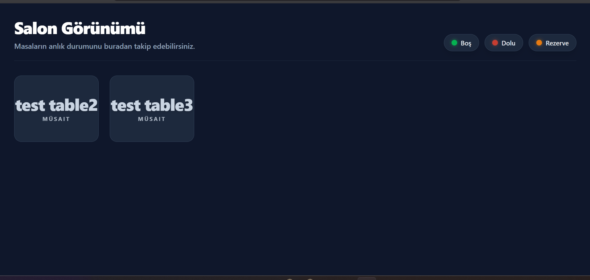
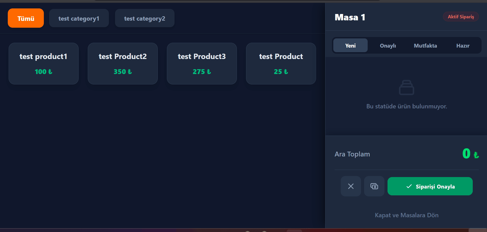

<h1 align="center">🍽️ RestaurantBill</h1>

<p align="center">
  <strong>A full-stack Restaurant POS & Kitchen Display System</strong><br/>
  Built with Clean Architecture, CQRS, and real-time messaging
</p>

<p align="center">
  
  
  
  
  
  
  
</p>

<p align="center">
  <a href="https://github.com/fatihkayaci/RestaurantBill/actions/workflows/dotnet-ci.yml">
    
  </a>
</p>

<p align="center">
  <a href="https://bill.fatihkayaci.com">
    
  </a>
</p>

---

## 📸 Screenshots & Demo

### Table Management


### POS Order Flow


---

## 📋 Overview

RestaurantBill is a production-ready Point of Sale (POS) application designed for restaurant operations. It enables waitstaff to manage tables and orders in real time, while the kitchen receives instant notifications through an asynchronous message queue — eliminating the need for manual communication between the floor and the kitchen.

### Key Highlights

- **Clean Architecture** — strict separation of Domain, Application, Infrastructure, and Presentation layers
- **CQRS with MediatR** — Commands and Queries are fully decoupled for scalability and testability
- **Real-time Kitchen Notifications** — order updates are published to RabbitMQ and consumed by a background service
- **Role-Based Authorization** — JWT authentication with Admin, Waiter, Cashier, and Kitchen roles
- **Modern Dark UI** — responsive React frontend with Tailwind CSS featuring a neon/dark aesthetic

---

## 🏗️ Architecture

```
RestaurantBill/
├── Backend/
│   ├── RestaurantBill.Domain          # Entities, Enums, Domain Interfaces
│   ├── RestaurantBill.Application     # CQRS Handlers, DTOs, Validators, Interfaces
│   ├── RestaurantBill.Infrastructure  # RabbitMQ Producer & Consumer (Background Service)
│   ├── RestaurantBill.Persistence     # EF Core, Repositories, UnitOfWork, Migrations
│   └── RestaurantBill.WebAPI          # Controllers, Middleware, Program.cs
└── frontend/
    └── src/
        ├── pages/                     # TablesPage, PosPage, KitchenPage
        ├── features/                  # Feature-sliced: orders, tables, products, categories
        └── api/                       # Axios service layer
```

### Backend Layer Responsibilities

| Layer | Responsibility |
|-------|---------------|
| **Domain** | Core business entities and rules, zero dependencies |
| **Application** | Use cases via CQRS (MediatR), FluentValidation, AutoMapper |
| **Infrastructure** | External services — RabbitMQ producer/consumer |
| **Persistence** | EF Core + PostgreSQL, Generic Repository, Unit of Work |
| **WebAPI** | HTTP endpoints, JWT auth, global exception middleware |

---

## 🧠 Key Design Decisions

- **Why Clean Architecture?** The Domain layer has zero framework dependencies — business logic is portable and testable in complete isolation, regardless of whether the persistence layer uses EF Core, Dapper, or anything else.
- **Why CQRS?** Read and write operations on orders have very different complexity profiles. Separating them via MediatR pipelines allowed adding validation and logging as cross-cutting concerns (Pipeline Behaviors) without touching any business logic.
- **Why RabbitMQ over WebSockets for kitchen notifications?** If the Kitchen Display System is temporarily offline, orders must not be lost. RabbitMQ's durable, persistent queue guarantees delivery — a guarantee WebSockets fundamentally cannot provide.
- **Why Repository + Unit of Work over raw EF Core?** Abstracting persistence behind interfaces allows the entire Application layer to be tested with Moq-mocked repositories — no real database, no migrations, no test containers required. This is directly visible in the 15+ unit test suites.

---

## ✨ Features

### Table Management
- Visual salon view with real-time table status (Available / Occupied / Reserved / Out of Service)
- Open, close, reserve, and cancel reservation from the same interface

### POS (Point of Sale)
- Dynamic category filtering for the product menu
- Add/remove order items with quantity control
- Order item status tracking: **Pending → Preparing → Ready → Delivered**
- Confirm and send orders to the kitchen with one click
- Cancel active orders

### Kitchen Display System (KDS)
- Dedicated kitchen view for order queue management
- Status-based filtering per item
- Real-time update via RabbitMQ message consumption

### Authentication & Authorization
- JWT Bearer token authentication
- Role-based access: `Admin`, `Waiter`, `Cashier`, `Kitchen`
- ASP.NET Core Identity with custom User/Role entities

---

## 🧪 Testing

Unit tests cover all CQRS command and query handlers using **xUnit + Moq**. The Application layer is tested in complete isolation — no database, no HTTP server, no RabbitMQ required.

| Suite | Covered Handlers |
|-------|-----------------|
| **Order Commands** | CreateOrder, AddProductToOrder, CancelOrder, CloseOrder, RemoveProductFromOrder, UpdateOrderItemQuantity |
| **Order Queries** | GetAllOrders, GetOrderById, GetActiveOrderByTableId |
| **Table Commands** | CreateTable, OpenTable, ReservationTable, CancelReservation |
| **Table Queries** | GetAllTables, GetTableById |
| **Services** | ProductService |

```bash
# Run all tests
cd Backend
dotnet test
```

---

## 🛠️ Tech Stack

### Backend
| Technology | Purpose |
|-----------|---------|
| **.NET 9.0** | Web API framework |
| **Entity Framework Core 9** | ORM + migrations |
| **PostgreSQL 16** | Primary database |
| **MediatR 14** | CQRS mediator |
| **FluentValidation** | Input validation pipeline |
| **AutoMapper** | DTO ↔ Entity mapping |
| **RabbitMQ.Client 7** | Async message broker |
| **ASP.NET Core Identity** | User/role management |
| **JWT Bearer** | Stateless authentication |
| **Serilog** | Structured logging |
| **Swagger + Scalar** | API documentation |
| **xUnit + Moq** | Unit testing framework & mocking |

### Frontend
| Technology | Purpose |
|-----------|---------|
| **React 19** | UI framework |
| **TypeScript 5.9** | Type safety |
| **Vite 7** | Build tool & dev server |
| **React Router v7** | Client-side routing |
| **Tailwind CSS 4** | Utility-first styling |
| **Axios** | HTTP client |

### Infrastructure
| Technology | Purpose |
|-----------|---------|
| **Docker Compose** | Orchestrates PostgreSQL, PgAdmin, RabbitMQ |
| **RabbitMQ** | Decoupled kitchen notification system |
| **PgAdmin 4** | Database management UI |

---

## 🔑 Demo Credentials

After running `docker-compose up` and starting the API, the following demo accounts are seeded automatically:

| Role | Username | Password |
|------|----------|----------|
| **Admin** | `admin` | `Admin123*` |
| **Waiter** | `waiter` | `Waiter123*` |
| **Kitchen** | `kitchen` | `Kitchen123*` |
| **Cashier** | `cashier` | `Cashier123*` |

> The demo restaurant comes pre-loaded with 8 tables, 3 categories, and 12 products.

---

## 🚀 Getting Started

### Prerequisites

- [.NET 9 SDK](https://dotnet.microsoft.com/download)
- [Node.js 20+](https://nodejs.org)
- [Docker Desktop](https://www.docker.com/products/docker-desktop)

### 1. Environment Setup

Create a `.env` file in the root directory:

```env
DB_USER=your_db_user
DB_PASSWORD=your_db_password
DB_NAME=RestaurantDb

RABBITMQ_USER=admin
RABBITMQ_PASS=admin_password
```

Then configure sensitive values (JWT secret, DB connection string, RabbitMQ credentials) via .NET User Secrets:

```bash
cd Backend/RestaurantBill.WebAPI
dotnet user-secrets set "JwtSettings:SecretKey" "your_secret_key"
dotnet user-secrets set "ConnectionStrings:DefaultConnection" "Host=localhost;Port=5432;Database=RestaurantDb;Username=your_db_user;Password=your_db_password"
dotnet user-secrets set "RabbitMQ:Username" "admin"
dotnet user-secrets set "RabbitMQ:Password" "admin_password"
```

### 2. Start Infrastructure Services

```bash
docker compose up -d database rabbitmq pgadmin
```

This starts:
- **PostgreSQL** on `localhost:5432`
- **PgAdmin** on `localhost:5050`
- **RabbitMQ** on `localhost:5672` (Management UI: `localhost:15672`)

### 3. Run the Backend

```bash
cd Backend/RestaurantBill.WebAPI
dotnet ef database update
dotnet watch
```

API will be available at `http://localhost:5077`  
Swagger docs: `http://localhost:5077/swagger`

### 4. Run the Frontend

```bash
cd frontend
npm install
npm run dev
```

App will be available at `http://localhost:5173`

---

## 📡 API Reference

### Authentication
| Method | Endpoint | Description |
|--------|----------|-------------|
| `POST` | `/api/auth/register` | Register a new user |
| `POST` | `/api/auth/login` | Login and receive JWT token |

### Orders
| Method | Endpoint | Description |
|--------|----------|-------------|
| `GET` | `/api/order` | Get all orders |
| `GET` | `/api/order/table/{tableId}` | Get active order for a table |
| `POST` | `/api/order` | Create a new order |
| `POST` | `/api/order/add-product` | Add items to an order |
| `POST` | `/api/order/cancel` | Cancel an order |

### Tables
| Method | Endpoint | Description |
|--------|----------|-------------|
| `GET` | `/api/table` | Get all tables |
| `POST` | `/api/table/create` | Create a table |
| `POST` | `/api/table/{id}/open` | Open table (set Occupied) |
| `POST` | `/api/table/{id}/close` | Close table (set Available) |
| `POST` | `/api/table/{id}/reservation` | Reserve a table |
| `POST` | `/api/table/{id}/cancel-reservation` | Cancel reservation |

### Products & Categories
| Method | Endpoint | Description |
|--------|----------|-------------|
| `GET` | `/api/product` | Get all products |
| `POST` | `/api/product/create-product` | Create a product |
| `PUT` | `/api/product/update-product` | Update a product |
| `DELETE` | `/api/product/{id}` | Delete a product |
| `GET` | `/api/category` | Get all categories |
| `POST` | `/api/category/create-category` | Create a category |

---

## 🔄 Order Flow

```
Waiter (POS)                Backend                 Kitchen (KDS)
    │                          │                          │
    ├─── Add items to order ──►│                          │
    │                          │                          │
    ├─── Confirm order ───────►│                          │
    │                          ├── Publish to RabbitMQ ──►│
    │                          │      order_queue         │
    │                          │                          ├── Receive notification
    │                          │                          ├── Update status: Preparing
    │                          │                          ├── Update status: Ready
    │                          │                          │
    ◄── See status update ─────┤◄── Status propagates ───┤
```

---

## 🗄️ Data Model

```
Restaurant
  └── Tables (Available / Occupied / Reserved / OutOfService)
        └── Orders (Active / Preparing / Ready / Served / Paid / Cancelled)
              └── OrderItems (Pending / Preparing / Ready / Delivered)
                    └── Products
                          └── Categories
```

All entities extend `BaseEntity` which provides:
- `Id`, `CreatedAt`, `UpdatedAt`, `CreatedUser`, `IsDeleted` (soft delete)

---

## 🔐 Roles & Permissions

| Role | Access |
|------|--------|
| **Admin** | Full system access |
| **Waiter** | Table & order management |
| **Cashier** | Payment processing |
| **Kitchen** | Read order queue, update item status |

---

## 📦 Project Status

> Current version: `0.0.3-development`

**Completed:**
- [x] Clean Architecture + CQRS setup
- [x] Table lifecycle management
- [x] Full order management
- [x] OrderItem status tracking
- [x] JWT authentication & roles
- [x] RabbitMQ integration
- [x] Docker Compose infrastructure
- [x] Dark mode POS UI with category filtering
- [x] Unit tests for all CQRS command/query handlers (xUnit + Moq)

**Planned:**
- [ ] Payment processing flow
- [ ] Reservation detail management (customer name, time, party size)
- [ ] Real-time WebSocket updates to frontend
- [ ] Reporting & analytics dashboard
- [ ] Mobile-responsive KDS view

---

## 🤝 Contributing

Pull requests are welcome. For major changes, please open an issue first to discuss what you would like to change.

---

<p align="center">
  Built with ❤️ using .NET 9 & React 19
</p>
